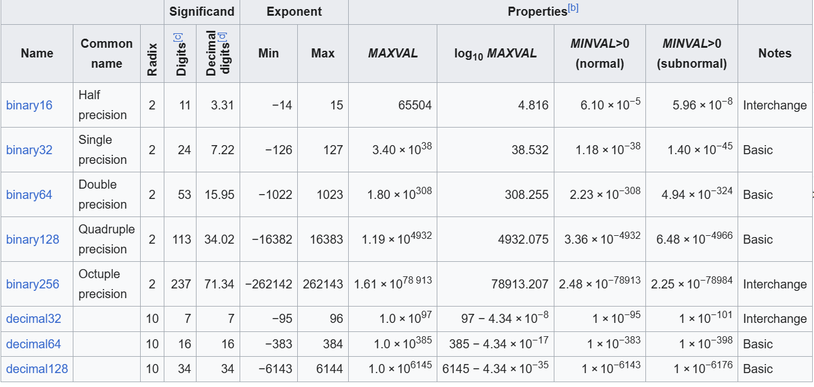

# Gibbs Sampling and Boltzmann Weighting for Ship Configurations

## Integer Labeling and Distribution

Assign an integer labeling to individual ship positions and let  
$\pi$ be a distribution over integer $n$-tuples, where $n$ is the number of ships.

---

## Detailed Balance in the Gibbs Sampler

The Gibbs sampler satisfies **detailed balance**, which can be verified by expressing the joint probability as the product of:

1. A single new draw conditioned on the remaining ship positions, and
2. The joint probability of the remaining ship positions.

---

## Boltzmann Weighting Variants

Boltzmann weighting can take different forms:

1. **Pairwise intersections:**  
   Energy counts all pairwise intersections $\binom{n}{2}$.

2. **Excess count:**  
   Energy counts the excess $\max(0, n - 1)$.

3. **Indicator of excess:**  
   Energy counts the indicator $\max(0, \min(1, n - 1))$.

Here, $n$ represents the number of occupants on a square.

---

## Computing Energy Incrementally

Weighting methods (1–3) are naturally computed over the squares but can also be viewed **as cumulative sums** when ships are placed one by one:

- **Pairwise intersections:** Add new pairwise collisions at each square.
- **Excess count:** Add the size of the intersection between occupied squares and the new ship.
- **Indicator of excess:** Restrict the previous count to squares that had occupancy 1.

---

## Reformulating Marginal Weights

We need a further reformulation in how marginal weights are computed.

- The **total board energy** can be expressed as a sum over consecutively placed ships.
- A **single ship’s contribution** can then be computed as a sum over the squares it occupies.
- The **weighting update** can therefore be applied one square at a time.

---

## Possible Fractal Behavior

Fractals somehow?

---

## Bounding the Average Energy

We can place a crude bound on the **average energy**.

The probability of observing a non–ground state is bounded by:

\[
\frac{w_2}{w_1 + w_2}
\]

where

- $w_1 = |\Omega_0|$,
- $w_2 = (T - |\Omega_0|)\, e^{-\beta}$, and
- $T$ is the total number of states.

Since $w_2 > w_{\text{true}}$ and $x / (1 + x)$ is increasing, we obtain:

\[
\mathbb{E}[E] \le E*{\max} \cdot \frac{w_1}{w_1 + w_2}
\le E*{\max} \cdot \frac{T e^{-\beta}}{|\Omega_0|}
\le C e^{-\beta}
\]

for some constant $C$.

---

## Example: 10×10 Grid with 10 Ships

For a 10×10 grid with 10 ships, the **integral over energy** is approximately −0.4649.

Let:

- $Z(\infty)$ denote the number of distinct length-10 tuples taking values in $\{1, \ldots, 100\}$, and
- $Z(0)$ denote the number of **zero-overlap** arrangements with distinct ships.

Then:

\[
\log Z(\infty) = \log Z(0) - \int_0^{\infty} -\langle E \rangle(\beta)\, d\beta
\]

and equivalently,

\[
\frac{Z(\infty)}{Z(0)} = \exp\!\left(-\!\int \langle E \rangle(\beta)\, d\beta\right)
\]

which checks out.

Note that the samples for energy approximation are correlated. So drawing with variation in mind is

Here's what we need to work out next. The random sampling in this problem is characterized by a sparse (or nearly sparse, not the same) weight vector and frequent but minor weight updates.

The more important consideration is probably the fact that weight updates are minor.

Quantum algorithms for this problem?

Comments on custom RNG:
Floats encode values in scientific notation. Bits are reserved for the exponent shift and the number of significant digits. The table below details the standard.  

The C++ float corresponds to the binary32 capable of storing numbers.

This problem has a discrete set of weights in bijection with the energy levels. This mean that sampling can be done by mapping ship ids to energy levels. Therefore, we do not need to maintain a separate weight array.

We maintain a mapping between ids and indices at each level. We achieve constant time removal that preserves the mapping by exchanging the roles of the removed and the last element in the list.

What are the common elements of every new gamestate in one beta walk?
Possible ship arrangements (ref)
initial configuration of active ships (ref)

All initial configurations begin with no overlap:
energy array (default values suffice)
bucketed ids (default values suffice)
bucketed ids to idx (copy)
total_weight

Am i doing too much and can i be faster if i did less?
The goal now is to make the beta walk, all else constant.

I'm going to implement some feeble logic to optimize for speed. There is no reason to use dictionaries if I give ships an id attribute corresponding exactly to their index in ships.

At some point I'm going to have to look at mixing times. Minimizing the number of iterations would be a great improvement.

The current slowdown comes from update buckets, it is polynomial in k, or from the operations involved with processing the whole grid when n is large (in main and compute square energy).

The pairwise weighting method would hypothetically lead to slow downs in sampling, since the max energy is proportional to kq. But overflow is proportional to k. It would also be practical to cache the weights associated with these energies, at worst, if I use pairwise, it becomes proportional to n^2.

Max square energy vs max ship energy.

It might be nice to have the property of additive energy over squares. on the other hand, i have different energy levels corresponding to the same weight, and the max energy that i set is incorrect for weightings like hard.

Can i stil lbucket into 0,1 for hard and just map all higher energies to 1? Should i even be considering the weighting right now?

Hard code parameters and compile for speed?

the data is fit by an exponential ae^-b*beta. So that means log Z of beta equal a/be^-b * beta + C and Z of beta equal e^(a/b \* e^-b \* beta) times e^C.

Resources:
https://www.keithschwarz.com/darts-dice-coins/
https://www.aarondefazio.com/tangentially/?p=58
